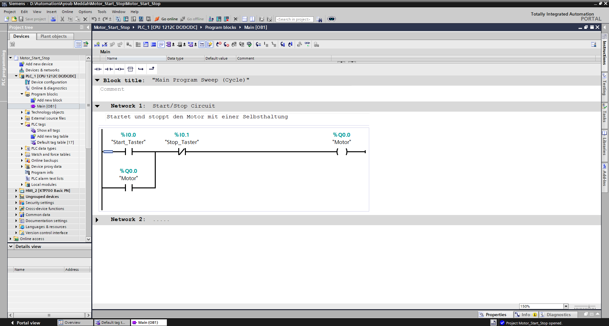
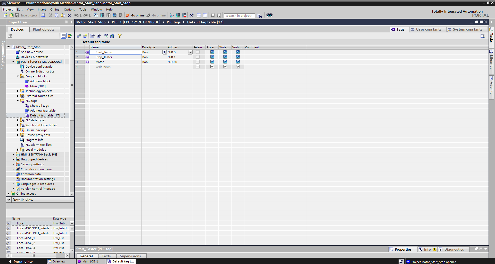
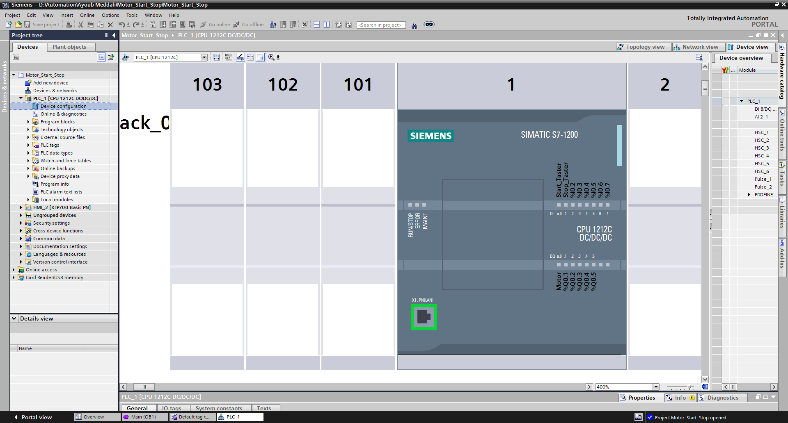
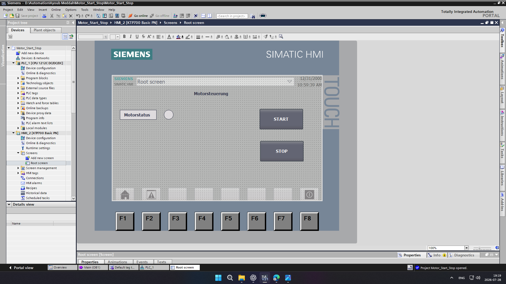

# s7-1200-motor-control

Dieses Projekt habe ich mit Siemens TIA Portal V17 und einer S7-1200 CPU erstellt.

Das Ziel war es, eine einfache Motorsteuerung mit einer Start-/Stopp-Funktion zu programmieren. Der Motor wird über einen Starttaster eingeschaltet und bleibt durch die Selbsthaltung aktiv. Mit dem Stopptaster wird der Motor wieder ausgeschaltet.

## Verwendete Software und Hardware

- Siemens TIA Portal V17
- Siemens S7-1200 CPU 1212C DC/DC/DC
- KTP700 Basic PN
- Ladder Logic (LAD)

---

## Ladder Logic

Die Start-/Stopp-Schaltung wurde mit einer Selbsthaltung umgesetzt. Nach dem Drücken des Starttasters bleibt der Motor eingeschaltet, bis der Stopptaster betätigt wird.

---

## PLC-Tags

Start_Taster (%I0.0): Startet den Motor.

Stop_Taster (%I0.1): Stoppt den Motor.

Motor (%Q0.0): Steuert den Motor.

---

## Hardware-Konfiguration

Die Konfiguration zeigt die verwendete Siemens S7-1200 CPU und die Einstellungen des Projekts.

---

## HMI

Über die HMI kann der Motor gestartet und gestoppt werden. Außerdem wird der aktuelle Zustand des Motors angezeigt.

